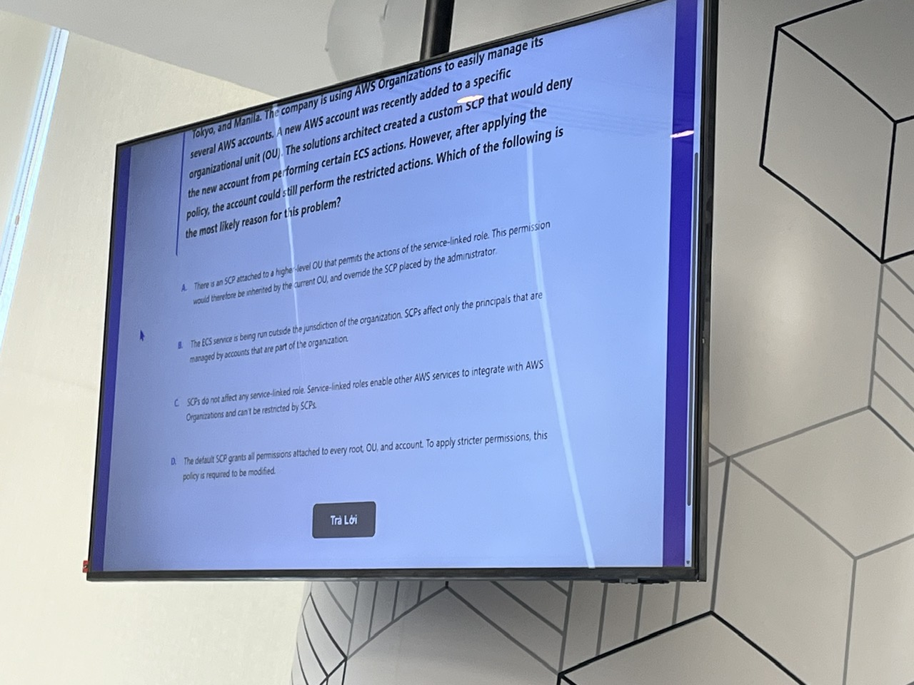

## Event information

- **Date:** June 20, 2026
- **Organizer:** First Cloud AI Journey (FCAJ)
- **Participants:** Students taking part in the FCAJ internship program
- **My role:** Audience member and observer
- **Scale:** Eight teams

## Purpose of the event

The competition gave interns an opportunity to review and apply the AWS knowledge learned before the event. It tested not only the ability to remember service names, but also the ability to analyze an architecture, select an appropriate service, and resolve cloud scenarios. Observing the timed rounds also showed how team members explained their reasoning, reached a shared decision, and took responsibility for the team's answer.

## Competition format

Eight teams competed in knockout rounds. On the day I attended, the remaining quarterfinal and semifinal matches were held. Each round consisted of ten multiple-choice AWS questions. Team members had a limited amount of time to read each scenario, compare the options, and submit one answer for the team. I attended as an audience member, followed how the teams handled each question, and compared their answers with the AWS knowledge I had learned.

The questions covered two levels of difficulty. Foundational topics were similar to the scope of **AWS Certified Cloud Practitioner**, while the more demanding architecture and scenario questions were closer to **AWS Certified Solutions Architect**. This combination required both a sound understanding of AWS fundamentals and the ability to connect several services in a practical situation.

## Highlighted content

### AWS and Cloud knowledge

The questions covered the shared responsibility model, IAM, account security, Amazon EC2, containers, Amazon S3, databases, VPC networking, scalability, high availability, cost optimization, AWS Organizations, and Service Control Policies. For scenario-based questions, I observed that teams had to identify the decisive requirement, eliminate unsuitable options, and select the solution that best satisfied all constraints.

### Observing discussion and consensus

Different members sometimes interpreted the same question differently. From the audience, I saw how they stated their reasoning briefly, listened to counterarguments, and used the wording of the scenario to focus the discussion. This showed me that teamwork is not simply voting for the most popular answer. A shared technical decision needs a clear justification, and each member must be prepared to revise an initial choice when another explanation is better supported.

## What I learned

### AWS knowledge

The event helped me consolidate the AWS and cloud concepts learned before the competition and better understand how IAM, Organizations, networking, compute, storage, and databases interact in one architecture. It also improved my ability to read scenario questions, identify the primary requirement, and rule out options that failed to meet it.

### Example question: Service Control Policies

One question described an organization that used **AWS Organizations** to manage multiple accounts. A new account was added to an Organizational Unit and an SCP denied certain Amazon ECS actions, yet those actions could still be performed through a **service-linked role**. The question asked for the reason.

**Correct answer:** SCPs do not restrict service-linked roles.

A service-linked role is an IAM role defined and used by an AWS service to perform required operations on the customer's behalf. AWS Organizations SCPs do not limit permissions granted to service-linked roles. Therefore, an action performed through such a role may still succeed even when the same action is denied for ordinary IAM users or roles in the member account.

The other choices were unsuitable because an Allow policy in a parent OU cannot override an explicit Deny, an SCP does not stop applying merely because a service runs in another Region, and the default `FullAWSAccess` SCP neither grants permissions nor overrides a Deny. This question helped me distinguish IAM policies, SCPs, and service-linked roles, and reminded me to identify the exact principal performing an AWS action before evaluating permissions.

### Teamwork observations

By observing the competing teams, I learned the value of presenting an opinion concisely, listening to other members, and comparing explanations before agreeing on one answer. The more difficult semifinal questions also showed why a team needs to remain calm, manage its limited time, and combine the knowledge of several members.

## Event experience

The quarterfinal and semifinal rounds created noticeable pressure because both the question count and response time were limited. Foundational questions tested recall, while the harder scenarios required careful analysis of architecture and permissions. The greatest value for me was observing how the teams discussed evidence and reached a defensible decision. Although I did not compete directly, I could analyze each question, compare my reasoning with the teams' answers, and identify gaps in my AWS knowledge.

## Evidence

<em>Figure 4.1. An AWS Organizations and Service Control Policy scenario used in the competition.</em>

## Conclusion

The FCAJ competition helped me review AWS and cloud knowledge through a practical and highly interactive format. In addition to revisiting services and architectures, I strengthened my analytical thinking and learned from how the teams explained technical choices, listened to one another, and made decisions under time pressure.
