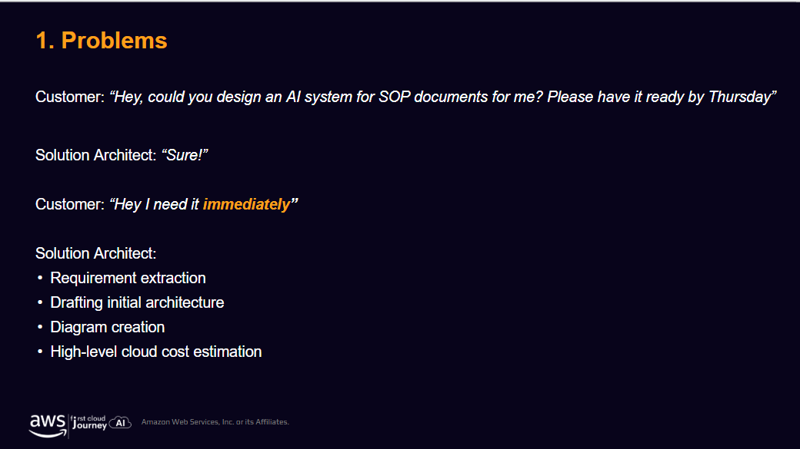
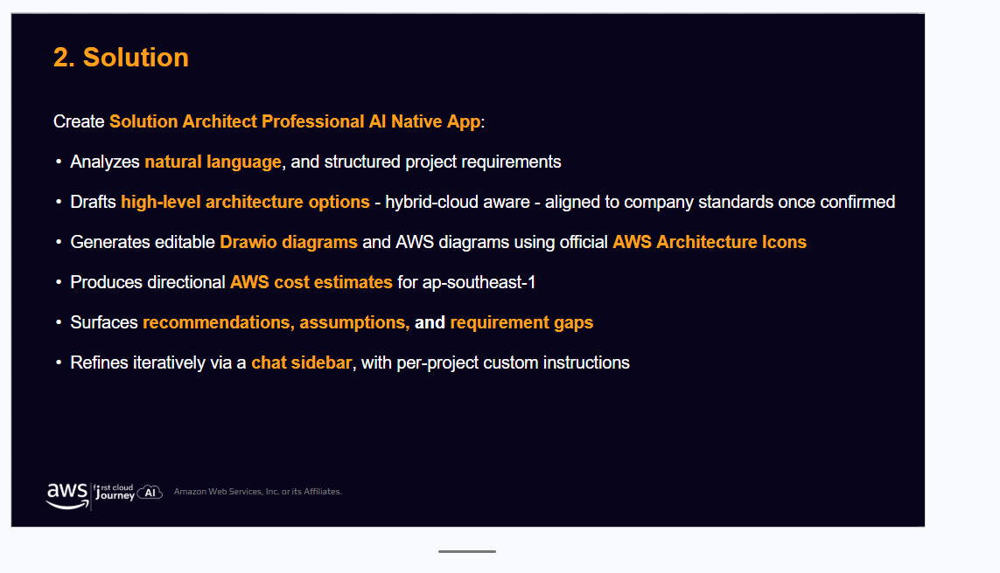
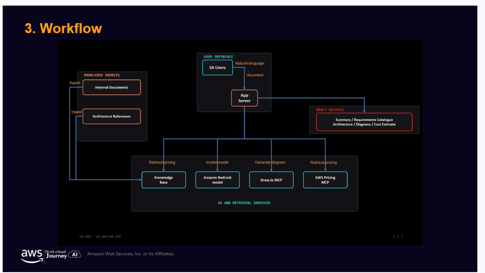
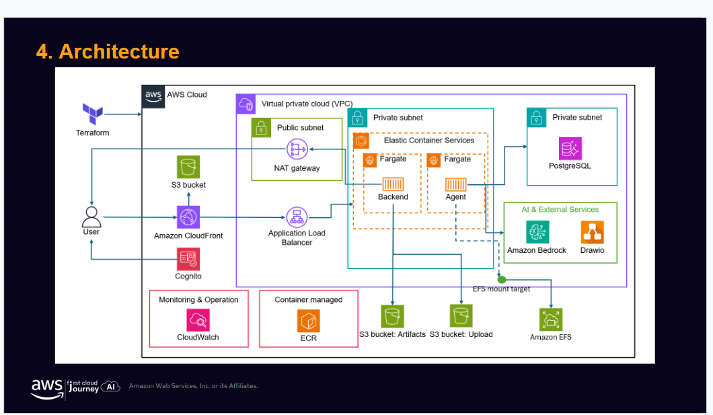
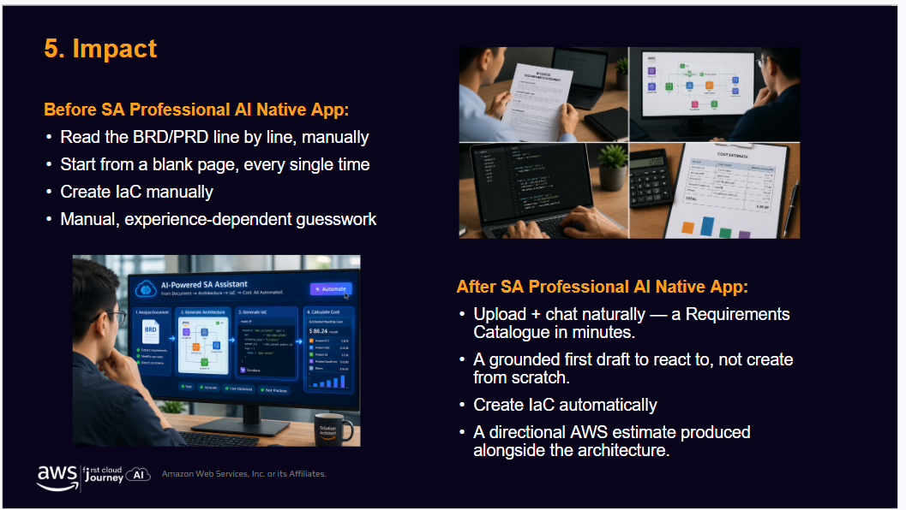
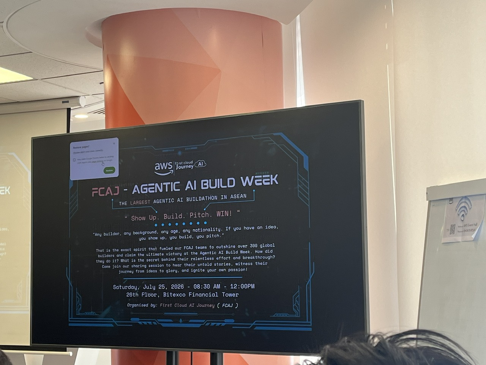
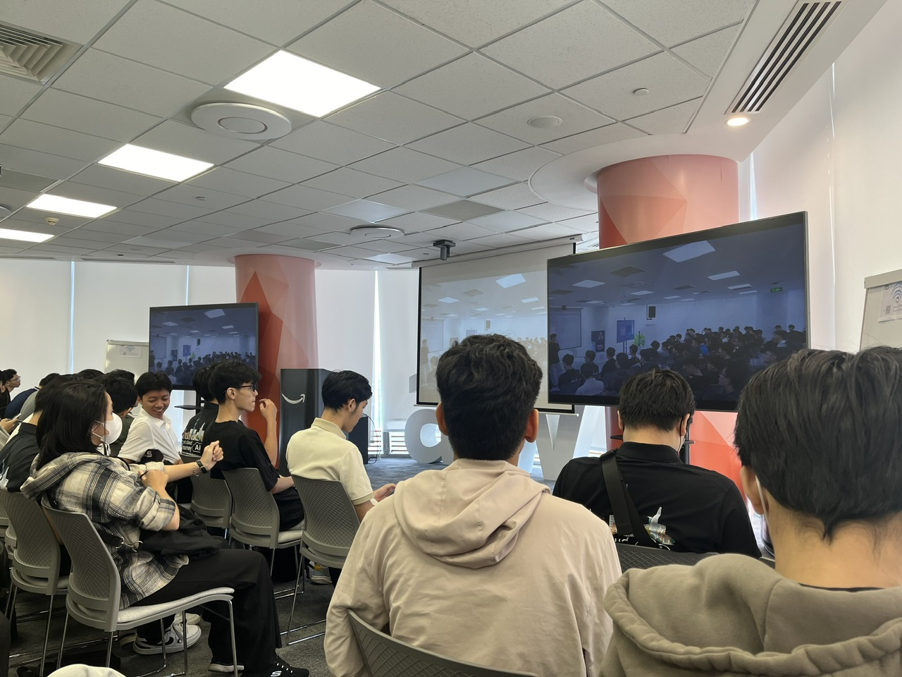

# Event Report: “FCAJ Sharing Session – Agentic AI Build Week 2026”

## Event information

- **Event:** FCAJ Sharing Session – Agentic AI Build Week 2026
- **Time:** 08:30–12:00, Saturday, July 25, 2026
- **Location:** 26th Floor, Bitexco Financial Tower, Ho Chi Minh City
- **Organizer:** First Cloud AI Journey (FCAJ)
- **My role:** Attendee at the sharing and closing session

## Context and objectives

**Agentic AI Build Week 2026 (AABW 2026)** was an Agentic AI hackathon organized by GenAI Fund in Ho Chi Minh City from July 8–12, 2026. AWS was the strategic partner and supported the **Built with AWS Track**, where teams developed deployable AI applications using Amazon Bedrock and other AWS AI/ML technologies.

The session I attended on July 25 was not part of the official competition schedule. It was a post-competition sharing and closing session organized by the FCAJ community to:

- Review the journeys of four FCAJ teams at AABW 2026.
- Explain their problem definition, MVP development, and pitching process.
- Discuss challenges involving business logic, architecture, and teamwork.
- Share the Built with AWS Track results and practical lessons with FCAJ members.

## FCAJ teams and results

| Team | Product or presentation | Built with AWS Track result |
| --- | --- | --- |
| **One Team** | KFC BOT – an AI agent for ordering through messaging platforms | **Winner** |
| **SignalScout** | An Agentic AI solution refined through repeated building and testing | **Runner-Up** |
| **3KA** | S.H.E.P.H.E.R.D. – camera-based venue monitoring and operational support | **Top 6** |
| **SA Professional** | AI-Native Requirements-to-Architecture Assistant for Solution Architects | AWS Track participant; no official award information found |

“Hackathon Journey 3KA” and “OneTeam CommunityDay” were presentation titles in the shared materials; the competition team names were **3KA** and **One Team**. The speakers discussed not only their products but also idea formation, task allocation, problem solving, and pitch preparation.

## Key content

### Problem definition and business logic

A product should begin with a real user need instead of a desire to apply complex technology. Teams must identify the intended users, the problem, the primary business workflow, and the expected outcome. New AI models or cloud services cannot compensate for unclear business logic.

### Scope management

The buildathon required teams to move quickly from an idea to a demonstrable product. They had to prioritize the most valuable functions, allocate work, prepare demo data, test the primary workflow, and reserve time for pitching. Attempting too many features could reduce the quality of the core experience.

### Team coordination

An effective team needs more than technical ability. Members must communicate, listen, and take responsibility. Problem analysis, development, testing, and presentation need to support one shared objective. Frequent communication helps prevent misunderstandings and enables timely scope adjustments.

### Communicating product value

A pitch must explain the problem, target users, solution workflow, and delivered value. A technical demo proves feasibility, but business value explains why the product should exist.

## Case study: SA Professional AI Native App

### Problem

A Solution Architect must review SOP documents, extract requirements, draft architecture options, create diagrams, and estimate cloud costs under severe time pressure. These activities involve substantial manual work and depend strongly on professional experience.

<em>Figure 4.3. The problem addressed by SA Professional AI Native App.</em>

### Solution

The application accepts documents or natural-language requirements and assists with requirement extraction, gap identification, high-level architecture drafting, editable Draw.io diagram generation, directional cost estimation for `ap-southeast-1`, and iterative refinement. Its outputs are grounded drafts for professional review rather than replacements for the Solution Architect's decisions.

<em>Figure 4.4. Main capabilities of SA Professional AI Native App.</em>

### Workflow

Users submit documents or descriptions through the application. The App Server coordinates a Knowledge Base, Amazon Bedrock, Draw.io MCP, and AWS Pricing MCP to produce a requirements catalogue, architecture options, diagrams, and cost estimates. Internal documents and architecture references ground the results in project context.

<em>Figure 4.5. Workflow from knowledge sources to draft outputs.</em>

### Technical architecture

The presented architecture uses CloudFront and S3 for the interface, Cognito for authentication, and an Application Load Balancer to route requests to backend and agent workloads on Amazon ECS/Fargate in private subnets. PostgreSQL stores data, while Amazon Bedrock, Draw.io, ECR, EFS, S3, CloudWatch, and Terraform support AI, diagram generation, deployment, storage, and operations.

<em>Figure 4.6. AWS architecture of SA Professional AI Native App.</em>

### Impact

Without the assistant, a Solution Architect reads BRD/PRD documents manually, starts deliverables from a blank page, creates IaC by hand, and estimates costs largely through experience. The proposed solution creates a requirements catalogue and initial drafts more quickly, allowing specialists to focus on validating requirements, assessing risks, and making decisions.

<em>Figure 4.7. Workflow comparison before and after using the assistant.</em>

## Lessons learned

### Product thinking

- Begin with the problem and user need before selecting technology.
- Define business logic so that every feature supports a clear objective.
- Prefer one complete primary workflow over many disconnected features.
- Evaluate a solution by its usefulness, not only its technical complexity.

### Teamwork

- Select members based on skills, responsibility, and collaboration.
- Assign clear roles while maintaining a shared objective.
- Communicate frequently and make decisions early.
- Support one another when defects or scope changes occur.

### Buildathon skills

- Limit scope according to the available time.
- Test the complete demo scenario.
- Keep the pitch concise and consistent with the working product.
- Explain value in plain language instead of relying on technical terminology.

## Application to work

- Define requirements and business workflows before designing features or architecture.
- Assign team tasks through specific deliverables and frequent progress updates.
- Complete core functions before expanding scope.
- Use architecture diagrams and cost estimates to communicate solutions clearly.
- Use AI to accelerate draft creation while retaining human review.

## Event experience

The session provided insight into the practical pressure of a buildathon: limited time, changing requirements, demo preparation, and continuous team coordination. The four presentations showed that the most effective solution is not necessarily the most complex one; it must identify the right problem, meet the need, and communicate its value clearly.

### Event evidence

<em>Figure 4.8. FCAJ Agentic AI Build Week program information at Bitexco Financial Tower.</em>

<em>Figure 4.9. Attendees listening to the FCAJ teams' presentations.</em>

## Conclusion

FCAJ Agentic AI Build Week provided lessons in Agentic AI product development, business-first thinking, scope management, pitching, and teamwork. These lessons are directly applicable to academic projects, team assignments, and professional work.