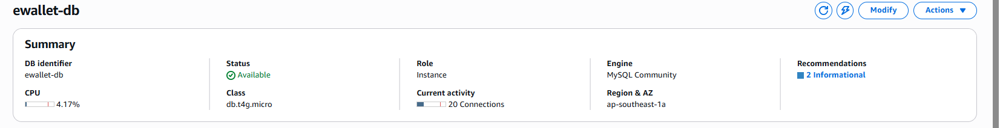

## Objective

This section presents the Amazon RDS for MySQL configuration used by the Cloud E-Wallet production environment. The database runs in private subnets and accepts MySQL connections only from the backend security group.

## Configure the RDS security group

Our team created `RDS-Ewallet-SG` in `ewallet-vpc`. Its only inbound rule allows MySQL/Aurora traffic on TCP port `3306` with the backend EC2 security group as the source. Using a security group rather than a fixed IP address ensures that only EC2 instances attached to the correct backend security group can connect to the database.

Port `3306` is not open to `0.0.0.0/0`, so RDS does not accept direct MySQL connections from the Internet.


<p style="text-align: center;"><em>Figure 5.3. The inbound rule allows only the backend security group to connect to RDS on port 3306.</em></p>

## Configure the DB subnet group

The `ewallet-rds-subnet-group` DB subnet group contains two private subnets in `ap-southeast-1a` and `ap-southeast-1b`. This configuration satisfies the Amazon RDS network requirement and separates the database from the public subnets used by Internet-facing components.


<p style="text-align: center;"><em>Figure 5.4. The DB subnet group uses two private subnets in two Availability Zones.</em></p>

## Amazon RDS for MySQL result



<p style="text-align: center;"><em>Figure 5.5. RDS MySQL `ewallet-db` uses the `db.t4g.micro` instance class and is Available.</em></p>

The project uses a MySQL Community RDS instance named `ewallet-db` with the `db.t4g.micro` instance class in the Singapore Region. After creation, the database reached the **Available** state.

Amazon RDS has public access disabled, and the database is not deployed in a public subnet. The backend connects through the internal RDS endpoint on port `3306`; its credentials are stored in `/home/ec2-user/ewallet-backend.env`. The real endpoint, username, and password are never included in source code or this report.

Documentation uses placeholders only:

```text
DB_URL=jdbc:mysql://<DB_ENDPOINT>:3306/<DB_NAME>
DB_USERNAME=<DB_USERNAME>
DB_PASSWORD=<DB_PASSWORD>
```

## Validation

After configuration, our team confirmed that:

- The RDS instance is **Available**.
- The database uses the correct VPC and a DB subnet group containing two private subnets.
- RDS has no public Internet access.
- Inbound port `3306` accepts only the backend EC2 security group as its source.
- The real endpoint and credentials exist only in the runtime configuration on EC2.

The schema and baseline data are initialized in Section 5.2.2 after the backend EC2 instances can connect to RDS.