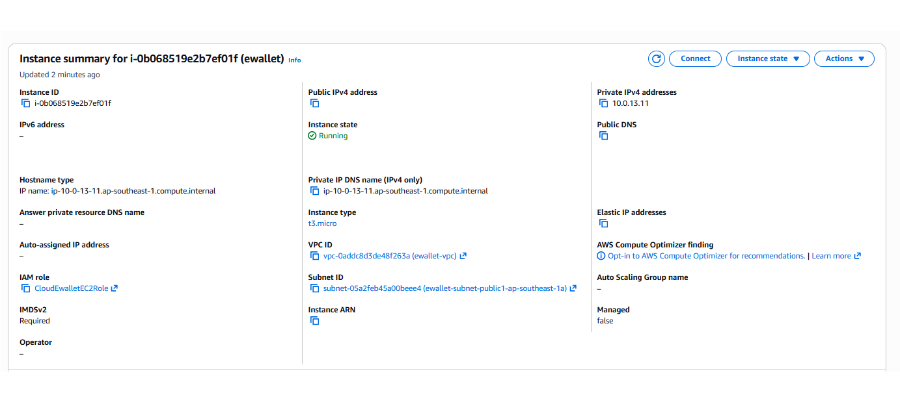

## Objective

Prepare the Amazon EC2 environment for the Spring Boot backend, install Docker, and configure connections to Amazon RDS and Amazon SES. This section summarizes the implementation process and uses the final resource states as evidence.

## Overall process

The team completed four stages:

1. Create EC2 capacity in the prepared VPC and subnets, then attach the required IAM role and security group.
2. Connect through SSH, install Docker, and verify Docker Engine.
3. Prepare Amazon SES in the Singapore Region and create separate SMTP credentials for the backend.
4. Create an environment file on EC2 so the container can connect to RDS, SES, and the frontend domain without storing secrets in source code.

## Prepare Amazon EC2

In the deployment architecture, the backend instances run Amazon Linux 2023 on `t3.micro`. A Launch Template is used by the Auto Scaling group to maintain two instances in private subnets across two Availability Zones, with `Min = 0`, `Desired = 2`, and `Max = 2`. The instances share the same base configuration. Outbound connections, including package and Docker image downloads, use the NAT Gateway in a public subnet and the VPC Internet Gateway; this path does not provide inbound SSH access.


<p style="text-align: center;"><em>Figure 5.6. The Auto Scaling group maintains two healthy backend instances across two Availability Zones.</em></p>

The `CloudEwalletEC2Role` IAM role is attached so the application and tools on EC2 can use the required AWS permissions without storing long-term access keys on the server. IMDSv2 is required to strengthen access protection for the Instance Metadata Service.

The EC2 security group follows these rules:

- Backend port `8080` accepts traffic only from the Application Load Balancer security group.
- Port `8080` is not exposed directly to `0.0.0.0/0`.
- Required outbound traffic uses the NAT Gateway for package downloads and Amazon SES SMTP; RDS connectivity remains inside the VPC.



<p style="text-align: center;"><em>Figure 5.7. A backend EC2 instance running in ewallet-vpc with its IAM role and IMDSv2 enabled.</em></p>


<p style="text-align: center;"><em>Figure 5.8. The EC2 security group permits backend traffic only from the ALB security group.</em></p>

## Install Docker

After an instance reaches **Running**, the team connects through SSH using the private management path and installs Docker on Amazon Linux 2023:

```bash
sudo dnf update -y
sudo dnf install -y docker
sudo systemctl enable --now docker
sudo usermod -aG docker ec2-user
```

After adding `ec2-user` to the `docker` group, the SSH session must be closed and reopened for the new group membership to take effect. Docker is then verified with:

```bash
docker version
```

The output confirms that both Docker Client and Docker Engine are available on `linux/amd64` and ready to run the Spring Boot container.


<p style="text-align: center;"><em>Figure 5.9. Docker Client and Docker Engine installed on EC2.</em></p>

## Prepare Amazon SES

The backend uses Amazon SES SMTP for account-verification and password-reset messages. SES is configured in Singapore (`ap-southeast-1`) to match the primary deployment Region:

1. Create and verify the `cloud-ewallet.com` domain identity.
2. Enable Easy DKIM and add the SES records to Cloudflare DNS with proxying disabled for email records.
3. Create application-specific SMTP credentials through `ses-smtp-user-cloud-ewallet`.
4. Use `email-smtp.ap-southeast-1.amazonaws.com`, port `587`, and STARTTLS.
5. Request production access so messages can be sent to unverified recipients.

The SES account is **Healthy** and has an approved quota of `50,000` messages per 24 hours with a maximum sending rate of `14` messages per second. This is an approved sending limit, not a free-email allowance.


<p style="text-align: center;"><em>Figure 5.10. Amazon SES in Singapore is healthy and has an approved production sending quota.</em></p>

## Prepare backend environment variables

The team creates `/home/ec2-user/ewallet-backend.env` on EC2 and restricts access:

```bash
chmod 600 /home/ec2-user/ewallet-backend.env
```

The real file contains RDS, JWT, frontend/CORS, and SES settings. The report uses placeholders only:

```dotenv
SPRING_PROFILES_ACTIVE=prod
DB_URL=jdbc:mysql://<DB_ENDPOINT>:3306/<DB_NAME>?useUnicode=true&characterEncoding=UTF-8&useSSL=true&requireSSL=true&serverTimezone=UTC
DB_USERNAME=<DB_USERNAME>
DB_PASSWORD=<DB_PASSWORD>
JWT_SECRET=<STRONG_RANDOM_SECRET_AT_LEAST_32_BYTES>
JWT_EXPIRATION=3600
FRONTEND_BASE_URL=https://cloud-ewallet.com
CORS_ALLOWED_ORIGINS=https://cloud-ewallet.com
MAIL_DEVELOPMENT_LOG_ENABLED=false
EMAIL_VERIFICATION_MINUTES=1440
PASSWORD_RESET_MINUTES=30
EMAIL_PROVIDER=ses
SES_SMTP_HOST=email-smtp.ap-southeast-1.amazonaws.com
SES_SMTP_PORT=587
SES_SMTP_USERNAME=<SES_SMTP_USERNAME>
SES_SMTP_PASSWORD=<SES_SMTP_PASSWORD>
SES_MAIL_FROM_ADDRESS=noreply@cloud-ewallet.com
```

Real credentials are never committed to Git, included in the report, or exposed in screenshots.

## Verification

The team confirms that the architecture places both EC2 instances in the correct VPC and private subnets, the IAM role and IMDSv2 are active, Docker Client and Engine work normally, and the security-group chain permits RDS on `3306` and SES SMTP on `587`. The SES account is healthy with production access, while the environment file has permission `600` and does not appear in the repository.

The image build, container release, and backend health checks are covered in Section 5.3.2.
